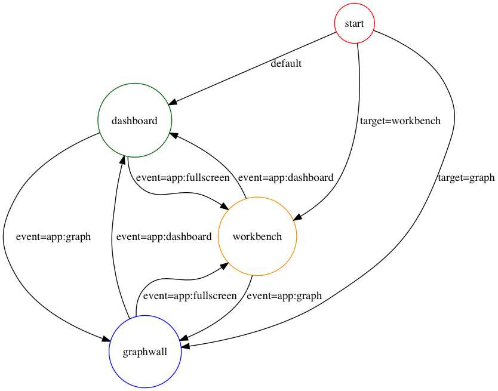

#Dashboard

##Architecture

Dashboard uses a MarionetteJS's Application Object to encapsulate the state of the dashboard Application.

It provides basic infrastructure like an event bus and request response API, though our current implementation is slightly incorrect as I mistakenly added a additional instances before I understood the full benefits of Application.

Dashboard does not currently take advantage of Marionette.Regions.

What Marionette does not provide is a state machine for managing state transitions between the various sub modules. Jake Gordon's [StateMachine](https://github.com/jakesgordon/javascript-state-machine) implementation wrapped around Backbone's default [Router](http://backbonejs.org/#Router) implementation does. Router takes care of the history API and navigation so that back and forward events are handled correctly by the browser.

Marionette uses Backbone.Wreqr to handle messaging. We make wide spread use of Event Aggregator across this app. We also use Request Response for handling synchronous queries. We do not use commands. This gives us a nice boundary between components to signal global events without being too knowledgeable about the sinks. This usage tries to follow Addy Osmani's [Mediator Pattern](http://addyosmani.com/largescalejavascript#mediatorpattern)

The 3 main events at the global level are

1. app:fullscreen -> transition to workbench
2. app:dashboard -> transition back to dashboard
3. app:graph -> transition to graphs

Application contains the handlers which manage leaving and entering the edges of the graph.




## Overall Project Structure
All the modules within client are bootstrapped using [Yeoman](http://yeoman.io/). This leads to very uniform project directory structures, which reduces congnitive load on developers who are familiar with the basic project layout:

###Top Level
 * **app/** - root of code and assets directory
 * **dist/** - build output
 * **Gruntfile.js** - Grunt commands to build project
 * **package.json** - project build dependencies managed via `npm`
 * **bower.json** - project runtime dependencies managed via `bower`
 
###app/
 * **scripts/** - all JavaScript code directly related to project
 * **scripts/vendor** - third party code, sometimes with customizations
 * **scripts/main.js** - [RequireJS](http://requirejs.org) configuration file
 * **scripts/collections** - Backbone Collections
 * **scripts/models** - Backbone Models
 * **scripts/routes** - unused
 * **scripts/views** - Backbone and Marionette View code
 * **scripts/helpers** - utility code
 * **scripts/locales** - Mozilla [L20N](http://l20n.org) config files
 * **scripts/templates** - JavaScript Templates ([JST](http://ricostacruz.com/backbone-patterns/#jst_templates)), using _.template - safer text replacement than concatenating strings
 
 * **bower_components/** - third party code, pristine via `bower`
 * **images/** - images for project, e.g. logos
 * **styles/** - css/sass assets. fonts
 * **styles/modules** - stand alone css/scss files with few or no dependencies
 * **styles/vendor** - third party css/scss files
 * **styles/partials** - scss files broken down roughly by sub-module, included via _base.scss

##Structural Components
###app.js
#####Responsibilities:
Startup and initialization of all views in the system. App.js is responsible for configuring the application via config.json, starting all the views, setting up the promises which request and wait for the initial JSON data and exporting those objects into the inktank namespace so they may be inspected.
   
###application.js
#####Responsibilities:
State machine, transitions and view state management. See above. TODO: a large portion of the graph UI code is in this file. This probably belongs in GraphWall.js.

###poller.js
#####Responsibilities:
Separation of network and polling code from view. The current version of Dashboard uses long-polling to communicate with the server. To not pollute view code with this, it was decided to separate out the polling into a separate view which used the event bus to signal to various dashboard widgets when an update had occurred and update their views.

In cases where large collections needed to be retrieved, the initial event to request the collection is controlled via poller and the event is sent to the view containing the collection so that it can update itself in a controlled manner.

This approach has the advantage of centralizing the polling for the dashboard in a single place and decouples the widgets from their data source. It also allows us to handle global updates to cluster ids in a few places rather than many which can lead to cascading event updates.

###tracker.js
#####Responsibilities:
Tracking long running tasks and notifications. The Calamari clients use indexdb to share outstanding request ids for the purposes of posting notifications to the UI when something of interest has occurred, like the completion of a long running task.

## Important JS Libraries and their usage

1. [JQuery](http://jquery.com/), [Underscore.JS](http://underscorejs.org/), [BackboneJS](http://backbonejs.org) & [MarionetteJS](http://marionettejs.com/) v1.2.3 - Views, Models, Collections and Memory Management. Provides the underpinning for the dashboard module.
2. [RequireJS](http://requirejs.org) - code loading and dependency management across entire module
3. [Noty](http://ned.im/noty/) - notifications and errors - alerts-view.js
4. [RaphaelJS](http://raphaeljs.com/) - OSD visualization
4. [Dygraphs](http://dygraphs.com/) - Graph plotting support - graph-wall.js
5. [Grunt](http://gruntjs.com/) and [NPM](http://www.npmjs.org) - for building and optimization
6. [KineticJS](http://kineticjs.com) - PG Status on Dashboard

##Start Up Ordering

1. RequireJS loads dependencies for code via main.js
2. App.js requests dependencies for application
3. App.js parses config.json
4. Initialize Views and Subsystems
4. App.js requests cluster metadata defaulting to first cluster returned in list
5. target= param specifies a default view to open

## List of Possible Events (not exhaustive)

|Event Name|Bus|Description|
|------|-----|-----------|
|**app:fullscreen**|App.vent|Switch to Workspace View|
|**app:dashboard**|App.vent|Switch to Dashboard View|
|**app:graph**|App.vent|Switch to Graph View|
|**cluster:update**|App.vent|Cluster Model has changed|
|**viz:filter**|App.vent|Filters have changed update Workbench|
|**viz:pulse**|App.vent|Animated Pulse set of OSDs on workbench|
|**switcher:one**|App.vent|Workbench switching to PG view|
|**switcher:two**|App.vent|Workbench switching to OSD view|
|**filter:update**|App.vent|Workbench filters have changed|
|**app:neterror**|App.vent|Network Error - display notification|
|**viz:render**|App.vent|OSD Visualization on Workbench has finished animation|
|**get:ready**|App.ReqRes|Is the application ready to run? Returns a JQuery promise.|
|**get:fqdns**|App.ReqRes|Get valid Fully Qualified Domain Names of hosts in Cluster|
|**get:osdcounts**|App.ReqRes|Curated OSD counts (down, inup, outup, indown)|
|**get:pgcounts**|App.ReqRes|OSD Map PG State Counts|
|**get:cluster**|App.ReqRes|Current Cluster Metadata|
|**get:hosts**|App.ReqRes|short hostnames for cluster members|
|**get:osdpgcounts**|App.ReqRes|PG States by OSD|


##Annotated Source Code
---------------------

Dashboard source code has been annotated using [docco](https://github.com/jashkenas/docco).

```
    grunt docco
    grunt copy:docco
```

Will generate a `docs/` directory which contains annotated source code as HTML.
